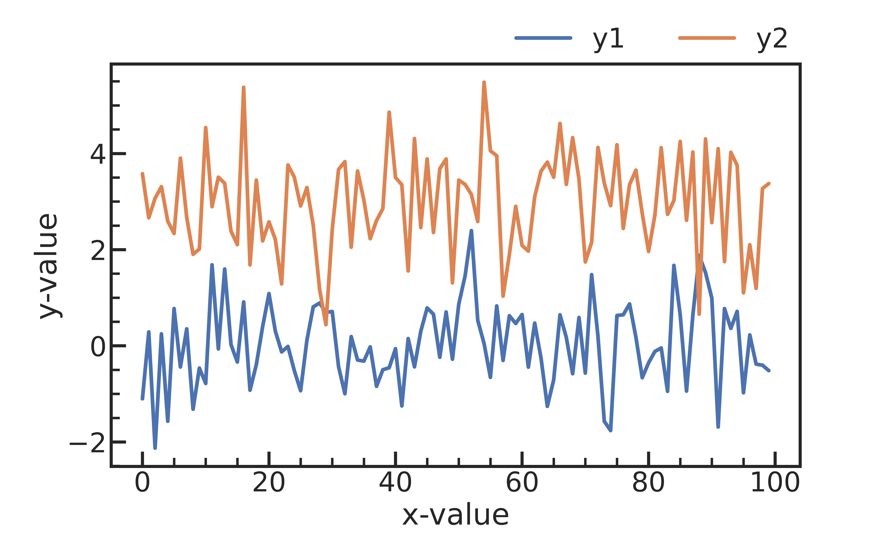
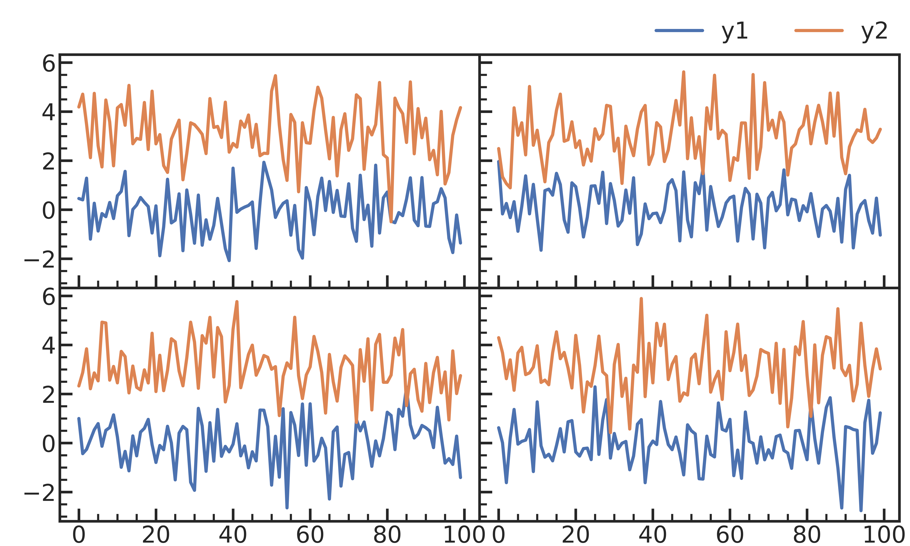

## Line Plots

### Single
```py
xdata = np.arange(100)
ydata = stats.norm.rvs(loc=0, size=100)

plt.plot(xdata, ydata)

plt.xlabel('x-value')
plt.ylabel('y-value')
```


### Multiple
```py
xdata = np.arange(100)
ydata_1 = stats.norm.rvs(loc=0, size=100)
ydata_2 = stats.norm.rvs(loc=3, size=100)

plt.plot(xdata, ydata_1, label='y1')
plt.plot(xdata, ydata_2, label='y2')

plt.yticks(va='top')
plt.xlabel('x-value')
plt.ylabel('y-value')
plt.legend(frameon=False)
```



## Subplots
```py
xdata = np.arange(100)
ydata_1 = stats.norm.rvs(loc=0, size=(4, 100))
ydata_2 = stats.norm.rvs(loc=3, size=(4, 100))

# Inner Element
nrows, ncols = 2, 2
fig, axs = plt.subplots(nrows, ncols, figsize=(5*1.2*ncols, 3*1.2*nrows), sharex=True, sharey=True)

for i in range(nrows*ncols):
    ax = axs[i//ncols, i%ncols]
    ax.plot(xdata, ydata_1[i], label=f"y1")
    ax.plot(xdata, ydata_2[i], label=f"y2")

# Common legend
handles, labels = ax.get_legend_handles_labels()
fig.legend(handles, labels, frameon=False, loc='upper right', ncol=2)

plt.tight_layout(pad=0)
plt.subplots_adjust(top=0.90, right=1, wspace=0, hspace=0)
```

