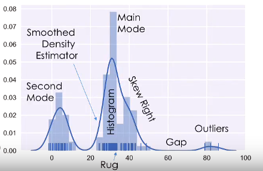

# Lecture Note 6 - EDA and Visualization

## Temporality

### Dealing with Time

* There are evidence in the date and time that shows whether or not the record was handwritten or by computer (e.g., computers often put decimal in times)
* Timezone are a nuisance to deal with but we must deal with it. Luckily there are packages like `datetime` in Python.
* Conventions of time
    * UTC (Coordinated Universal Time) is the best timezone to use because you can simply transform them to any region. The only con is that UTC does not account for daylight savings.
    * UNIX/POSIX time is a convention that started counting seconds ever since January 1, 1970

## Faithfulness
Prefer to consider this as the integrity of the data. Faithfulness/integrity depends on whether or not one should trust the data, does it have bias, is it consistent.

* Missing Values / Default Values:
    * Drop missing values
    * Infer on missing values
* Time Zone Inconsistencies
    * Convert to common time zone (e.g., UTC)
    * Convert to local time zone
* Duplications
    * Identify and drop (using primary key)
* Spelling Errors
    * Apply corrections and rop records not in dictionary
* Units Inconsistencies or Unknown
    * Infer units.
* Truncated Data
    * Look for the complete data set.

## Visualization

* Quantitative Data
    * Histogram, box plots, rug plots, smoothed interpolations (KDE - Kernel Density Estimators)
    * Look fro spread, shape, modes, outliers, unreasonable values
* Nominal & Ordinal Data
    * Bar plots (sorted by frequency or ordinal dimension)
    * Look for skew, frequent and rare categories, or invalid categories
    * Consider grouping categories and repeating analysis

### Histogram

